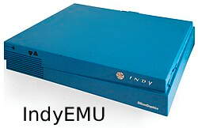

# IndyEmu



IndyEmu is a C++ SGI Indy emulator project focused on the MIPS R4400-era platform, the SGI Indy PROM path, and the staged hardware model needed to reach a real workstation boot flow.

This project is intentionally open and contributor-friendly. If SGI / IRIX developers, emulator researchers, or people with historical hardware knowledge find the repo, they are welcome to contribute fixes, diagnostics, device models, and improvements.

## Project goals

- emulate the SGI Indy hardware profile with a realistic boot path
- keep the CPU, memory, and register model grounded in real Indy behavior
- reach the PROM and early hardware initialization before adding the broader system model
- build a retro QT shell in the IndigoMagic / workstation aesthetic
- keep the long-term target open to IRIX and later system software work
- make the emulator portable across Linux, Windows, and macOS

## Current status

This repository is in the early-to-mid emulator stage:

- CMake-based C++17 build
- working MIPS CPU stepping model
- PROM loading and real sample ROM boot path
- COP0 and boot ROM instruction handling underway
- memory + bootstrap config model in place
- Qt-based retro GUI shell for the system overview and future hardware controls

This is not a finished SGI workstation yet. The project is intentionally staged around the real order:

1. CPU expansion and instruction correctness
2. PROM and boot path continuation
3. memory map and hardware register windows
4. graphics, sound, storage, and networking
5. IRIX and later system software targets
6. interpreter/JIT optimization after the machine model is stable

## Research direction

The project is grounded in the SGI Indy / IRIS hardware model and the public MAME `indy_4610` references as a source-of-truth for the actual machine layout. The goal is to keep the emulator respectful of the real hardware rather than inventing a synthetic design.

## Build

```bash
cmake -S . -B build
cmake --build build
./build/indyemu
./build/indyemu_gui
```

## Default setup

The command-line emulator defaults to a minimal SGI Indy-style startup profile:

- 128 MB RAM
- no attached storage by default
- embedded PROM image under the config root
- OS-specific config directory for machine profiles and raw disks

Config directories:

- Linux: `./config/indyemu`
- Windows: `./indyemu`
- macOS: `./indyemu`

## Input model

- click the emulator window to capture keyboard and mouse input
- Right Ctrl releases the input grab
- this keeps the early CLI/GUI runtime simple while the machine is still being developed

## License

This project is licensed under the BSD 3-Clause License.

See [LICENSE](LICENSE) for the full text.

## Contributing

Pull requests, issue reports, and architectural improvements are welcome. The project is intended to stay open to contributors from the SGI / IRIS / workstation emulation communities as the emulator matures.
